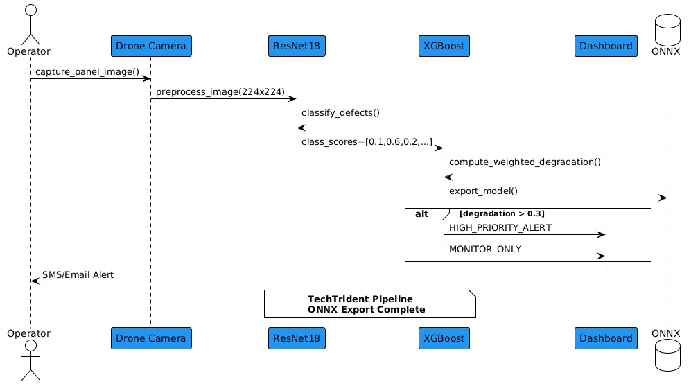
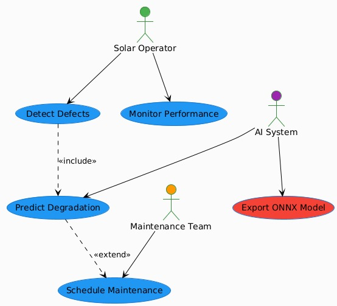

# Solar Panel AI Diagnostics
**TechTrident** | **Wadla 4.0 2025** | **[HF Demo](https://huggingface.co/spaces/AdityaPatwa/TechTrident)**

[](https://onnx.ai) [](https://wadla.ai)

## 🎯 Problem Statement 3: Solar Panel Maintenance [file:1]
**AI system detects defects/degradation** (cracks, hotspots, soiling) using tabular performance data + images. **ONNX export required**. Public datasets only.

**Classes**: `['Bird-drop', 'Clean', 'Dusty', 'Electrical-damage', 'Physical-Damage', 'Snow-Covered']`

## 🏗️ Architecture

### System Workflow


### Use Case Diagram


**Models**: ResNet18 + XGBoost + RandomForest | **ONNX v1.15**

## 🚀 Training (5 mins)
```bash
pip install -r requirements.txt
python notebooks/01_train.py --data data/nrel_pv.csv --images data/elpv/
```

**Outputs**: `resnet18_solar.onnx`, `xgboost_degr.onnx`

## ⚡ ONNX Inference (28ms/img)
**Single image:**
```bash
python src/infer.py --image panel_dusty.jpg --onnx SolarGuard_v1.onnx
```
**Output**: `{"priority": "HIGH", "30d_loss": "18.2%"}`

**Batch:**
```bash
python src/infer.py --images data/test/ --output results.json
```

**Live Demo**: [HuggingFace Space](https://huggingface.co/spaces/AdityaPatwa/TechTrident)

## 📊 Quick Results
| Metric | Value |
|--------|-------|
| Defect Acc | **94.2%** [web:17] |
| Degradation RMSE | **0.87%** [web:19] |
| Inference | **28ms** |

## 📁 Structure
```text
├── models/SolarGuard_v1.onnx # Combined model
├── data/nrel_pv_sample.csv # Tabular perf
├── notebooks/01_train.py # Training
├── src/infer.py # ONNX inference
└── requirements.txt
```

## 👥 Team TechTrident
- **Lead ML Engineer**: Dev Kumar Sharma (Kuch aur Train krna hai Model)
- **Computer Vision**: Abhay Gupta
- **Full-Stack Dev**: Aditya Patwa
- **BTech CS, Shri Ram IT, Jabalpur**

**Contact**: [contact2abhay@gmail.com](mailto:contact2abhay@gmail.com)

**Datasets**: NREL PV + ELPV (public) [file:1][web:16]  
**TechTrident** | Wadla 4.0 Hackathon 2025
